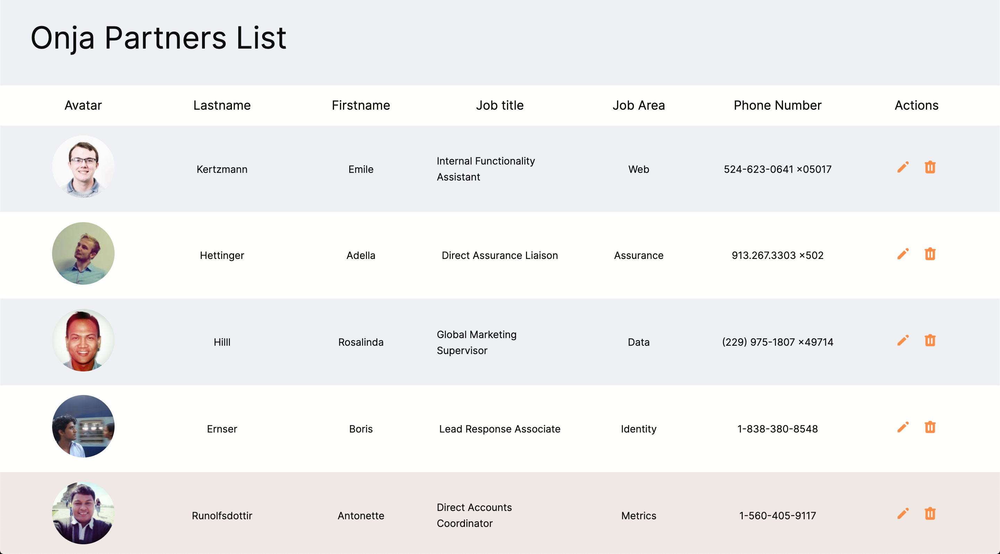

# WKP10

## Onja Partner List

This project will be a nice way to go deeper on the "Update" and "Delete" part of our javascript app.

The starter code will show a list of randomly generated partners, thanks to Faker. The function to display the data inside a table has already been coded for you.

Each partners will have two actions associated with their profile.

## Screenshot

## Edit partner

The pencil icon will allow you to edit a partner. Clicking this icon will show a popup, with a form inside, . The form will allow to edit the last name, first name, job title, job area and phone number, all at once. It means that when the popup will appear, the form input will be populated by the same data from the profile line, on which you clicked the pencil icon.

Once you made your edits, you can either "Save" the changes, or click "Cancel" to close the popup and come back to the previous state.

💡Wrapping the logic of each popup in their own Promise would make a lot of sense here. For inspiration, there are some great information about that topic on the video _72 (Async Await Prompt Ui)_.

## Delete partner

When you'll click on the trash icon, a popup will also appear. It will ask you a confirmation for the deletion, if you _really_ want to delete the partner.

-   If you click yes, the popup closes itself and the partner is deleted from the list.
-   If you click cancel, the popup closes itself as well, but the list stays the same.

## Student Report

-   What was the main challenge that you had to face during the project?
-   Did you use Promise callbacks? Or Async Await?

Good luck everybody 🐻
